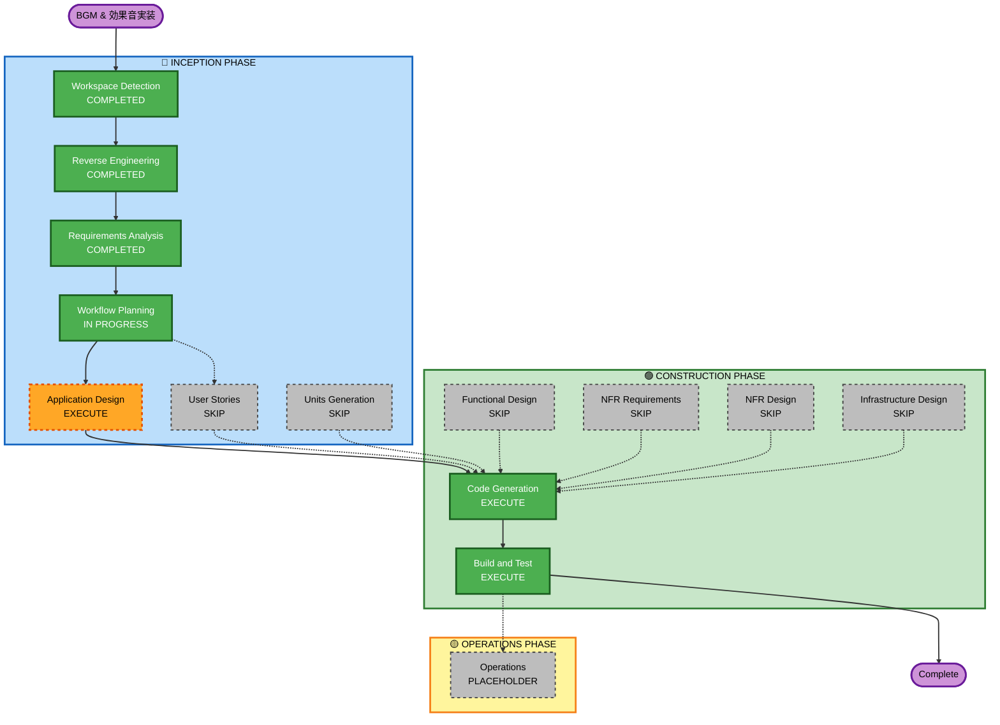

# Execution Plan: BGM & 効果音実装

## Detailed Analysis Summary

### Transformation Scope
- **変換タイプ**: Single-feature addition（音声システム全体の新設）
- **主要変更**: 新規 AudioManager サービス + 既存5シーン/サービスへの統合
- **関連コンポーネント**: BootScene, MenuScene, GameScene, GameOverScene, StorageService, GameConfig

### Change Impact Assessment
- **User-facing changes**: Yes — 音量調整UI がMenuSceneに追加される
- **Structural changes**: Yes — AudioManager（singleton）が新設される
- **Data model changes**: Yes — LocalStorageに音量設定が追加される
- **API changes**: No — 外部APIなし
- **NFR impact**: Yes — Autoplay Policy対応が必要

### Component Relationships

```
GameConfig ← AudioManager → StorageService（拡張）
                ↑               
    BootScene（preload）        
    MenuScene（BGM, UI）        
    GameScene（BGM, SFX, pause）
    GameOverScene（BGM stop, SFX）
```

### Risk Assessment
- **Risk Level**: Low
  - Phaser の組み込み Sound API を使用
  - 既存ゲームロジックへの影響なし
  - フリー素材の調達は事前に実施
- **Rollback Complexity**: Easy（音声ファイルとAudioManagerを削除するだけ）
- **Testing Complexity**: Simple（目視・聴覚確認で十分）

---

## Workflow Visualization



---

## Phases to Execute

### 🔵 INCEPTION PHASE
- [x] Workspace Detection — COMPLETED
- [x] Reverse Engineering — COMPLETED（音声関連フォーカス）
- [x] Requirements Analysis — COMPLETED
- [ ] User Stories — **SKIP**
  - **理由**: 機能が明確でシンプル。受け入れ基準は要件ドキュメントで十分。
- [x] Workflow Planning — IN PROGRESS（本ドキュメント）
- [ ] Application Design — **EXECUTE**
  - **理由**: 新規コンポーネント（AudioManager）の設計が必要。既存シーンとのI/F定義が必要。
- [ ] Units Generation — **SKIP**
  - **理由**: 実装単位は「音声システム」の1ユニットのみ。分解不要。

### 🟢 CONSTRUCTION PHASE
- [ ] Functional Design — **SKIP**
  - **理由**: 音声再生に複雑なビジネスロジックなし。AudioManagerのI/Fで十分。
- [ ] NFR Requirements — **SKIP**
  - **理由**: NFR要件（Autoplay Policy, .ogg形式, LocalStorage永続化）は要件で特定済み。
- [ ] NFR Design — **SKIP**
  - **理由**: NFR Requirements をスキップのため不要。
- [ ] Infrastructure Design — **SKIP**
  - **理由**: インフラ変更なし。ブラウザゲームの内部機能のみ。
- [ ] Code Generation — **EXECUTE**（ALWAYS）
  - **理由**: 実装が必要。
- [ ] Build and Test — **EXECUTE**（ALWAYS）
  - **理由**: ビルド・動作確認が必要。

### 🟡 OPERATIONS PHASE
- [ ] Operations — PLACEHOLDER（将来予定）

---

## Estimated Timeline
- **実行ステージ数**: 3（Application Design, Code Generation, Build and Test）
- **スキップ数**: 7
- **推定所要時間**: 1〜2セッション

## Success Criteria
- **Primary Goal**: BGM2曲・SFX7種の実装、音量調整UIの提供
- **Key Deliverables**:
  - `AudioManager.ts`（新規）
  - 音声ファイル（public/audio/）
  - 音量調整UI（MenuScene内）
  - StorageService の音量設定永続化
- **Quality Gates**:
  - ゲームプレイ中に音が鳴ること
  - ポーズ時にSFX停止・BGM音量ダウンが動作すること
  - 音量設定が再起動後も維持されること
  - ブラウザのAutoplay Policyに違反しないこと
